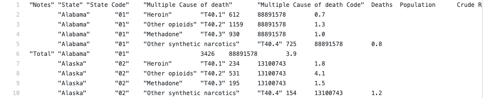
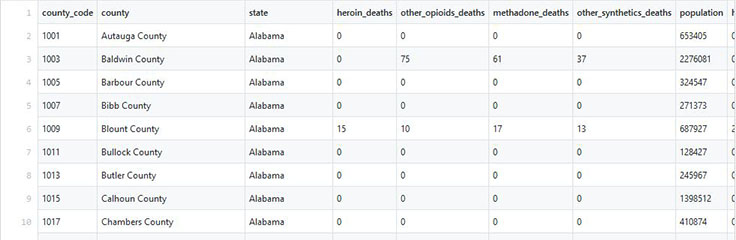
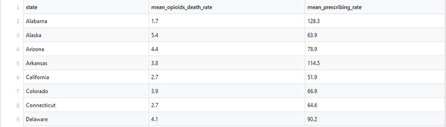
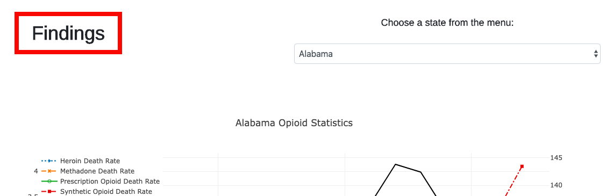
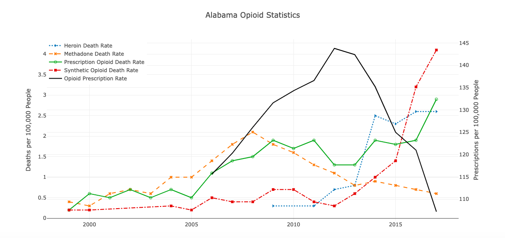
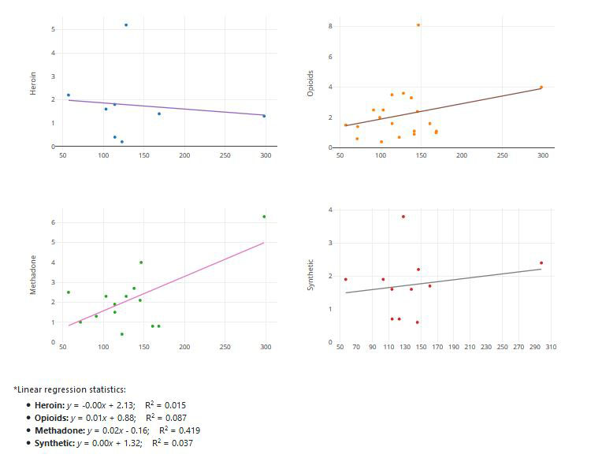
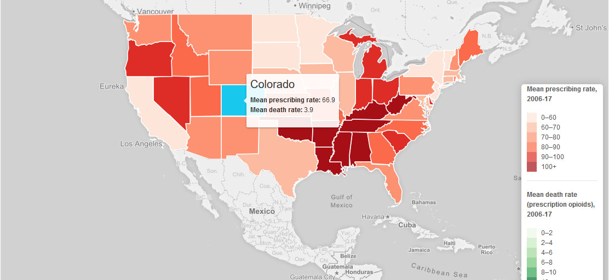

# State-Wide Opioid Analysis
### Marshall Doig, Stephanie Engeling, Willy Goal, Robert McAlmon, Ashley McGee

Dashboard: https://statewideopioidanalysis.herokuapp.com/

### Introduction:

Our analysis of opioid use and its subsequent adverse societal ramifications constituted Project 2 of the UT Data Analytics and Visualization Bootcamp through the McCombs School of Business. As a group, we decided to explore the relationship between opioid prescription rates and the rates of death by overdose for opioids in their respective forms in the United States over the past ten years.

Though our group had to admit the content was hardly the feel-good hit of the year, we all agreed that we found the material interesting enough to pursue a long project with it. Our group (whom we lovingly re-named "The Avengers") did not want to shy away from project work that examined real-world human behavior simply because it was not sensationalist eye candy, and we were not afraid of dealing with what we might find, even if it was disturbing. Each of us had some personal connection to the data we were exploring. In addition to this aspect, there was the added complication that during the bootcamp we needed to find lots of data quickly, usually sourced before the next time we met, which was every other day. We knew that the CDC and Vital Statistics would have no shortage of data to work with over our desired time-period.

### Special Considerations for Our Data

Going into the project, we knew we were going to need to limit the scope of our examination, but we didn't want to just analyze prescription opioid rates since most of that work has already been done and published. We weren't making any new sweeping generalizations, but we wanted to provided context for what we were exploring. That is why we included methadone, heroin, and synthetic opioids in addition to prescribed opioids medications to analyze the overall epidemic sweeping the nation. According to a consensus study called [*Pain Management and the Opioid Epidemic: Balancing Societal and Individual Benefits and Risks of Prescription Opioid Use*](https://www.ncbi.nlm.nih.gov/books/NBK458661/), after a sharp rise in prescription opioid use, "...nonmedical opioid use also started to increase markedly, reaching a peak of 2.7 million new users in 2002 (Kolodny et al., 2015)." It only made sense that we also examine non-traditional prescription opioids such as fentanyl in addition to OxyContin and oxycodone as well as heroin use since the rise in their use seemed to have been previously correlated.

### Data ETL

We knew we could pull prescribing data for prescription opioids by county and state from Vital Statistics with minimal effort. It was extracting information from the CDC that posed initial challenges. Though all of us were present during ETL, Marshall Doig was a key teammate when it came to the extrapolation and translation of the data we needed from the CDC. Originally, Marshall pulled several CSVs from varying years and discovered that the CDC (characteristic of any bureaucracy) encoded their cause of death data, and when causes of death were pulled per year, it included all causes of death. Marshall used a copy of the CDC's code parser to sift through the CDC's causes of death to include only those deaths where opioid overdose was the cause regardless of which opioid was used. While this worked for data up to the year 2013, Marshall was concerned that the parser was not current. Later we found that not to be the case, but before we sat down to test that theory, Marshall discovered the WONDER database, which gathered data from the CDC by year, state, and cause of death, parsed it, and pushed out a clean CSV for download. After that, the CDC data needed very little cleaning.
 

<em>The CSV output of the WONDER database, decoded for our convenience</em>

 

Though the CDC provided death rates by cause of death, groupmate Robert McAlmon suggested giving our own death rates, which he calculated and Marshall implemented for prescribed opioids, illegal opioids, and synthetic opioids. Marshall also calculated the prescribing and death rates for each traditional opioid and synthetic opioid. Working with our own prescribing rates and death rates meant we could reliably say that our death rates matched our given dataset rather than relying on the CDC or Vital Statistics. In addition to prescribing and rates per opioid by state, we were able to assess the prescribing and death rates by county in each state. 
 

<em>This large dataframe contained the prescribing rates, death rates, and vital statistics for each county for each year.</em>

 

However, this soon proved to be too granular, as many counties did not seem to "accurately" report the numbers of overdose deaths if those numbers were less than seven total deaths per year. Robert discovered that this is to protect the identities of overdose victims and their families. The CDC feared that death counts smaller than seven occurrences would make it too easy to identify those who had died, especially in sparsely-populated counties. Rather than take that risk, the CDC simply "suppressed" the death toll for that year if it was too low. 

Marshall then took each of the CSVs from the WONDER database and the scraped prescribing rates at the state and county levels from an interactive map that already contained that data from the CDC. He pivoted dataframes from each CSV and each scraped HTML set to present opioid death and prescribing rate for each state by year, the mean prescribing rate by state aggregated from the entire dataset, the death and prescribing rates of each county per state by year, and a CSV with the merged mean prescribing rate coupled with the mean death rate per state in aggregate. That last dataframe would be used to create the map in Leaflet.js later in the project.

<em>This dataframe would later be used as part of the route called to produce the Leaflet.js chloropleth map.</em>

 

### The API

Since we intended to make the dashboard presentation of our project interactive, we knew our back-end was going to be powered by Flask. Marshall and Willy Goal got together to load our translated data into an SQLite database, which Willy used to create our routes. 

Our first API route made a query to the SQLite database that selected all of the records from the states_all_years table and stored it in a variable called 'results'. Next, a for loop went through the 'results' variable and created a key value pair in a dictionary to a list called 'states'. The list was jsonified for use in the JavaScript interactive elements of the dashboard. 

The next two routes took county_state_by_year data from the SQLite database and jsonified two lists of county lists containing dictionaries of all the county prescribing data, the difference being that the first county route took state as an input and the second route did not need to, as it was designed for a separate dashboard section. The state input comes from a dropdown menu in the front-end interface that changes the output of the time-series and linear regression charts on the state chosen.

<em>Part of the interactive interface that allows users to view statistics based on the chosen state in the United States.</em>

The API 'prescribing' route took the state id, name, and mean prescribing rate from the States_prescribing_rate table and returned a jsonified dictionary for use in the time series and linear regression analysis.

### The Logic and Trends

We decided to produce exploratory visuals or our dashboard. Rather than rehash previous findings or make sweeping generalizations, we created a set of visuals that presented the data as it stood on its own. So much of what we as consumers of media rely on comes from data that is taken out of context, we decided to present the facts as they stood. We used a time-series graph created by Robert to show the prescription and death rates by state over time. The time-series graph was created in plotly, as were the county-level linear regression models (created by Stephanie Engeling) that broke down the prescription and death rates by opioid type. 

<em>A look at the time series plot for Alabama</em>

<em>Linear Regression plots display the relationship between death rates by overdose on opioids at the county level per substance type for the state of Alabama.</em>

A map created in Leaflet.js by Marshall gives a final, but broad, overview of prescription and opioid overdose rates by state. Originally, the map was meant to zoom in at the county level, but a difference in county names in our two data sets prevented a reasonable join in the data, and we could not add that feature to the GeoJSON Marshall manipulated from Leaflet's stock map design. 

<em>Leaflet.js map uses tooltips to display mean overdose and prescription rates by state. A toggle switches between colors on a chloropleth map.</em>

An interesting observation we noticed was a downward trend in opioid prescription rates starting in 2010. According to [History of the Opioid Epidemic: How Did We Get Here?](https://www.poison.org/articles/opioid-epidemic-history-and-prescribing-patterns-182), "The second wave of the opioid epidemic started around 2010 with a rapid increase in deaths from heroin abuse. As early efforts to decrease opioid prescribing began to take effect, making prescription opioids harder to obtain..." so it makes sense that prescription rates for opioids dropped shortly after or around 2010 as legislation was introduced to curb its use, especially in VA hospitals. Therefore, it is also not surprising to see heroin usage and thus overdose increasing as well. 

In running our linear regression analysis at the county level, we discovered just how unreliable our county data was. Because of so many years of suppressed data in some counties, our regression looked very badly fitted, which lead to the accuracy of our model being called into serious question. We got relatively low r-square values for prescribed opioids and overdose rates, revealing no coefficients greater than 0, but because of the unreliable county data, we're not sure if our regression describes low correlation, if the linear regression was the incorrect model, or if the model simply did not have enough information to train on for some counties. 

### The Design

I designed the dashboard's front-end. I was inspired by the out-reach group A21's website. A21 provides resources for victims of human trafficking. The A logo on the navigation bar stands for "Avengers", the fun-filled name of our group for each of our projects. The front-end was designed in Photoshop first before translating the PSD into a Bootstrap 4 template that is completely mobile-responsive with the exception of the plotly graphs, which do not scale. The map, however, does scale according to the size of its viewport. 

### Special Thanks

We owe a huge special thanks to our teacher's assistants and our groupmate Stephanie Engeling, who managed our remote repo and kept the group on track. She also assisted with CDC data cleaning and created the linear regression traces in plotly.

### Conclusions

Though our dataset was hardly ideal, we discovered that the real-world truth of our jobs would often be working with datasets that are far from perfect. We were tackling an ambitious dataset with our current skill level that we hope was representative of our skills at the time and can stand as a benchmark for later projects. I learned a great deal about user experience in presenting data, and like our MLB project, we learned that telling a story with data can take many forms. 

